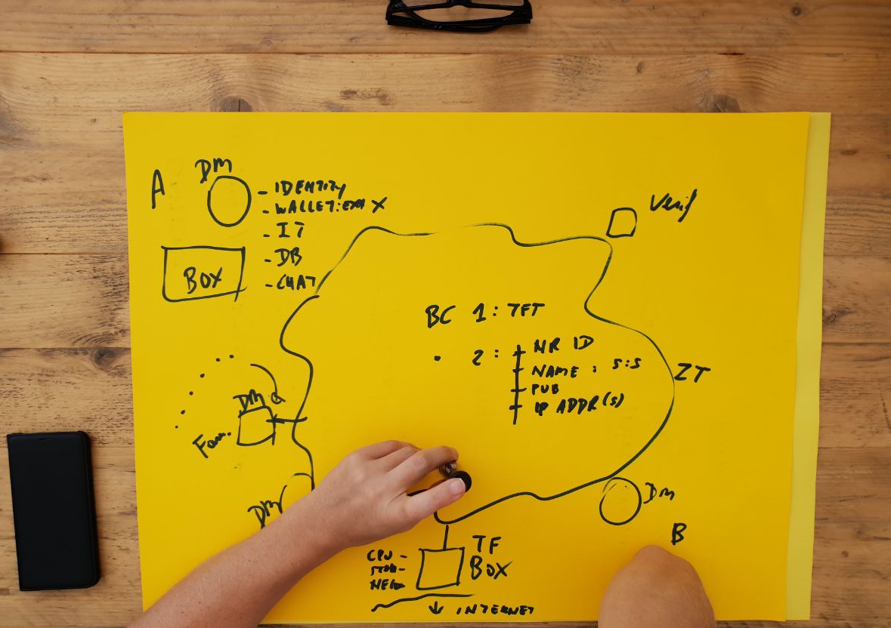

## 3bot - AKA digitalME

The 3bot is a robot that can assume a number of different roles.  The 3bot is meant to be the worker on the ThreeFold grid caring and maintaining all tasks required. There are a few type of 3bots which can be categorized as generic (or system) and personal 3bots.

The 3bot is a generic purpose framework of worker that runs in a zero-os container.  IT requires a zero-os operating system and therefore can run on the TF Grid on any of the participating nodes but is can also on off the grid nodes in virtual machines running zero-os.

The 3bot's have a private zerotier network which allows all of them to talk to eachother.  Through a mechanism of multicast each individual 3bot will be able to communicate and exchange information between a all of them.

Current type of 3bots that have purpose in the TF GRid are:
 - a personal 3bot for individuals and organisations that operate on the TFGrid
 - a farmer 3bot taking care of individual farmers capacity and all of its sales and operational tasks.
 - a verification 3bot providing neutral verification services throughout the TF Gdid.

### A personal 3bot.
You personal 3bot will act on your behalf and collects and manages information of you to perform tasks. The number of tasks that is is able to do for you will expand but for now it will be able to do the following things for you:
 - Generic User authentication and authorisation information and mechanism
 - Systems administrator taking care of TFGrid Administrative tasks
 - Crypto currency wallet.  Your wallet for crypto currencies (initially only the TFT)
 - A Database (general purpose storage capability)
 - Chat functionality. This is there as a facility to have interaction with the 3bot - but also person-2-person.

#### User Authentication and authorisation.
The user authentication mechanism is based on blockchain technology.  At this point in time the TF Grid runs 2 independent blockchains.  The first one is the financial transaction blockchain, tfchain and the second one is one dedicated to user authentication and authorisation. This blockchain contains other information than transactional information of TFT (or any other cryptocurrency).  This blockchain contains information that allows for a peer-to-peer user authentication and authorisation mechanism where there is no central database.  Even further to this sensitive personal information is not stored in the blockchain (as all blockchains by design have all stored information visible to anyone).  This blockchain <<need to come up with a name for this>> has the following information per entity (person, organisation, etc):
A identity number (unique)
A name in the format of <<5 bytes>>:<<5 bytes>>
The public key of a asymmetric private public key pair.
A number of  IP addresses

All other, more private information, is stored in a personal 3bot.  This 3bot will manage information for an individual or organisation in a secure manner.  Information stored will be:
Unsigned Encrypted by the private key of the asymmetric key pair - only to be able to be decrypted by the public  key.
Signed by the private key of the asymmetric key pair.  Making information that is stored in the 3bot database accessible and readable by anyone.  This information can be encrypted or unencrypted.

#### System Administration
the 3bot will take care of all the required actions to reserve capacity on the TFGrid.  It will build a (personal / private) directory of the available capacity on the grid by using a mechanisch 
#### Crypto currency wallet

#### A Database

#### Chat Functionality

### A farmer 3bot.

### A verification 3bot.
