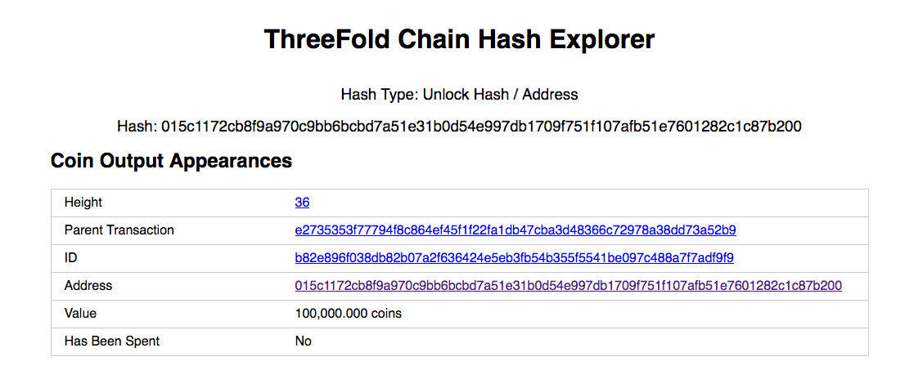
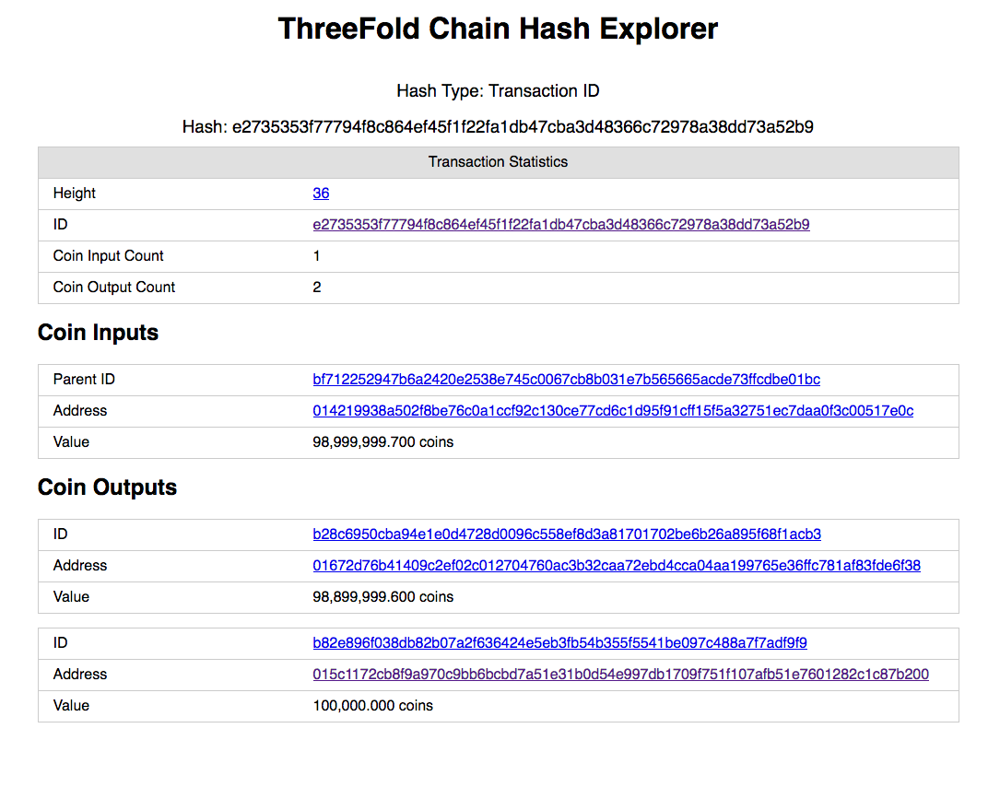
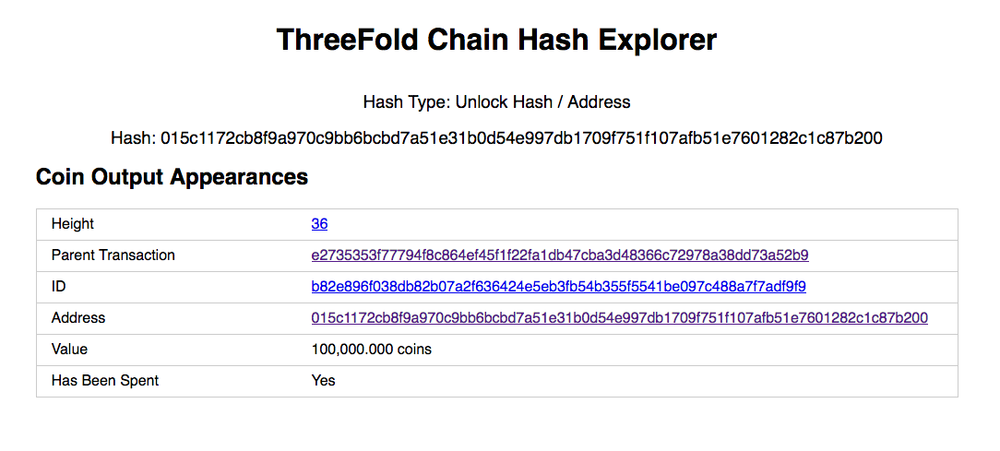
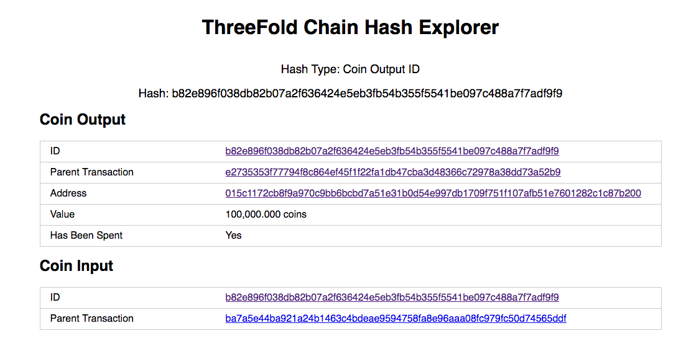
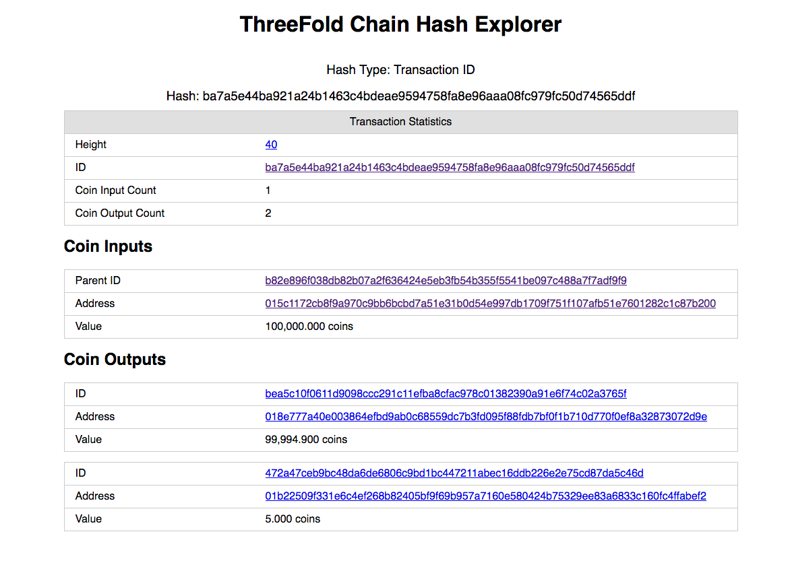

# Getting started with the ThreeFold Wallet

Here we discuss how to create and use the ThreeFold wallet from the command line.

For this we use the ThreeFold Chain client, `tfchainc`.

- [Get the ThreeFold Chain binaries](#get-binaries)
- [Connecting to a ThreeFold Chain node](#connect-node)
- [Initialize your ThreeFold wallet](#init-wallet)
- [Unlock your ThreeFold wallet](#unlock-wallet)
- [Manage your ThreeFold wallet addresses](#manage-addresses)
- [Receive your first ThreeFold tokens](#receive-tokens)
- [Send your first ThreeFold tokens](#send-tokens)
- [Check transaction in the Explorer](#explorer)

> We highly recommend against installing a wallet on the same host running a ThreeFold Chain Explorer


<a id="get-binaries"></a>
## Get the ThreeFold Chain binaries

Creating and using a ThreeFold wallet from the command line is done through the **ThreeFold Chain client**, `tfchainc`. 

See [Getting the ThreeFold Chain Binaries](/tf_technology/get_binaries.md) for instructions on how to get the ThreeFold Chain client.


<a id="connect-node"></a>
## Connecting to a ThreeFold Chain node

In order to use the ThreeFold Chain client (`tfchainc`) you need access to an active ThreeFold Chain node.

You can optionally create your own ThreeFold Chain node, as documented in [Creating a ThreeFold Chain Node](/tf_technology/create_node.md).

Test the connection as follows, specifying the address and port of the node you want to connect to with the `--addr` (`-a`) option:
```bash
./tfchainc --addr <ip>:<port>
```

So in case you have a ThreeFold Chain node on the same host as the client, using the default port:
```bash
./tfchainc --addr localhost:23110
```

In this case you can even omit the `-addr` option, since `tfchainc` by default will try connect to a local daemon on port 23110:
```bash
./tfchainc
```

In what follows we will assume you have a local node listening on the default port.


<a id="init-wallet"></a>
## Initialize your ThreeFold wallet

Initializing a new ThreeFold wallet is done by using the ThreeFold Chain client (`tfchainc`) as follows:
```bash
./tfchainc wallet init
```

This will ask you to enter and confirm a **passphrase**, and as a result you will get a **seed**, that will allow you to recover your wallet at any point, from any other computer. 

> Make sure to save your seed in a safe place.


<a id="unlock-wallet"></a>
## Unlock your ThreeFold wallet

When you check the status of your initialized wallet for the first time you will see that it is `Locked`:
```bash
./tfchainc wallet

Wallet status:
Unencrypted, Locked
Unlock the wallet to view balance
```

To unlock execute:
```bash
./tfchainc wallet unlock
```

Trying to unlock your waller before initialing will result in a error stating that your wallet has not been encrypted yet.

Once you entered your passphrase your wallet is ready to use:
```bash
./tfchainc wallet

Wallet status:
Encrypted, Unlocked
Confirmed Balance:   0 TFT
Unconfirmed Delta:   + 0 TFT
BlockStakes:         0 BS
```


<a id="manage-addresses"></a>
## Manage your ThreeFold wallet addresses

A new wallet is initialized with 10 addresses, here's how to list them:
```bash
./tfchainc wallet addresses

01034498a5b73b0aeb79e4fe4e932f83fd4bff522032af3237d7addd0ab5b360242a7af0c0b83c
010d0231a347f06ab59952176900dd597b378b3f53838a35e3d38debed667361fa4e730edeab91
0119350596eb74e486a04ce32c3176348c77d698e1cf47e776bee3786186fb3db0e6cc097ea7fa
011a8c47e21dbc472f77eee04cc4338bb8961ee4e264f26f1bcf76188378a7884f0aa745400805
0130f14db8c4ae0a33846a93f383045f2f3843c257b7dd487433ccacddccac2756a0a54a1d7aeb
01336a1354815b19ca2044efbb26538e84c1339bb5c06c647fc49d4916588af21e247712d06189
013dfe12ef547a6cacd4ae6698a60a45153115ade5971966be6fe803b8e33c2b82f2dc9543db90
014611cd2757c2cf7c64f0222829d486311254b3d517edc9a30daab0774ba32cd7d49d67e3f674
01581491c4df68686171c88bb3c6e357cb985126cedd32b6d14a24b03ccd438843a2ecc93d5d4c
0162634a892c43e9e71ff618f69959c8215a37a8d70e88a3d72f8bcc73f611abb04ebb82e47810
016546f6f6088805f12ddc4de43fe1c4fa8044982ac6ecee368fcf2101ded85f394e2948930cf6
0168625858a10bdf991c34677961fcb3ca98e33dfe2bc6132ec142ba486a972f09fc127d3d447e
0175d6ec9474274d54c34c9755319daab56e75e4ef4f4cd9d3a14b980126f8f8c15184aa3b6916
01785e0b22448d42b37ddfdc8d87612a550d708dd544b518525cd53a3a74819ab28612ff0791e0
01a34cdeda0f5baa1d6e7e67b462380328f5254f84ab1caeba988e9c26ee3875d1ab4a7018616f
01a569018f144c2def2bd0a67aa0ad675fa1f51afb295be9480be26e909d628ffa204ead5733f5
01af06f1f2b4809a5c36363278682109a3ba1c2cc0f7441e06bb1596d6f8d665b9b85384b59d62
01bb8e9391e0294ef77762e0708571477e9eaa590c0daf4ef8f9e39ccc0c6955759b4005d13df7
01bc208266b4c3a8b86bd873da87caf0114096897777c99b30c21c13c88a90de5ac3a6a0b5abde
01c65fa7ca80f1edc3c88f39d9e4f4290625fef1c08f6645ee0035c27fa9043c4e75d5f49198d7
01da85aae2443fc46fe15f3a22017a6a0865da788d7e53c7214fe6b2011fc10da0d2f051ee3945
01de5c2682f52c514175e689148068b588decadba1d053a55721ed75f2e6a7d2f4cdae83b2e60d
01e8bb9e93e40015a1ab79653ab2f66a50bc3308de5a2e4f04d2fc05f1d7e869ef1c113ced1367
01f138bfe2bfb3485a0d7a689703e706606a5a7bc430ec7fae87268b7d5ced86c9ba8174a0914d
01f8bd5a75eb5b2cc4d06aab1eb106625f4982ceddd5e379ff3b721a3a17065e2e1daf25f644bc
```

In order to create a new address:
```bash
./tfchainc wallet address

Created new address: 0150f4c2eb561d844da74dc9c4a673be4092bb3e8975d47dead6fc7954067c62a128e8d047c606
```


<a id="receive-tokens"></a>
## Receive your first ThreeFold tokens

Send one of your addresses to a token holder and ask him/her to transfer tokens to your Wallet.

Once done you can check your wallet as follows:
```bash
./tfchainc wallet
```

While the transaction is being processed you will see the number of tokens that are being transferred next to **Unconfirmed Delta**:
```bash
Wallet status:
Encrypted, Unlocked
Confirmed Balance:   0 TFT
Unconfirmed Delta:   + 100000 TFT
BlockStakes:         0 BS
```

By executing the ThreeFold Chain client without any additional option (`./tfchainc`) you can check the `height` of the ThreeFold chain:
```bash 
Synced: Yes
Block:  1f57f7f95e3f5ed16fd1dd0b3b8068b33d8766f5e647bcf2fe251837fa246a48
Height: 35
Target: [0 0 46 154 118 247 78 176 79 95 18 157 50 4 71 45 235 179 185 47 73 58 53 110 23 100 136 183 34 255 127 215]
```

Note that in this case the `height` is still `35`. Once the transaction is confirmed the `height` will be higher, at least `36`:
```bash 
Synced: Yes
Block:  72cc5ebbfa62126287e71c7516a0d5e3ead91eaa73314b89dbe24880b9bd26eb
Height: 36
Target: [0 0 46 154 118 247 78 176 79 95 18 157 50 4 71 45 235 179 185 47 73 58 53 110 23 100 136 183 34 255 127 215]
```

Checking your wallet once the transaction is confirmed by executing `./tfchainc wallet` will show your updated **Confirmed Balance**:
```bash
Wallet status:
Encrypted, Unlocked
Confirmed Balance:   100000 TFT
Unconfirmed Delta:   + 0 TFT
BlockStakes:         0 BS
```

<a id="send-tokens"></a>
## Send your first ThreeFold tokens

First get an address from a friend, for instance: `01b22509f331e6c4ef268b82405bf9f69b957a7160e580424b75329ee83a6833c160fc4ffabef2`.

In order to transfer 5 token execute:
```bash
./tfchainc wallet send coins 5 01b22509f331e6c4ef268b82405bf9f69b957a7160e580424b75329ee83a6833c160fc4ffabef2
```

You will get a confirmation:
```bash
Sent 5 TFT to 01b22509f331e6c4ef268b82405bf9f69b957a7160e580424b75329ee83a6833c160fc4ffabef2
```

When checking your wallet (`./tfchainc wallet`) while the transaction is being processed you'll see again an updated value next to **Unconfirmed Delta**:
```bash
Wallet status:
Encrypted, Unlocked
Confirmed Balance:   100000 TFT
Unconfirmed Delta:   - 5.1 TFT
BlockStakes:         0 BS
```

> Note the transaction fee of 0.1 TFT.


Checking the ThreeFold chain (`./tfchainc`) while the transaction is being processed shows:
```bash
Height: 39
Target: [0 0 46 154 118 247 78 176 79 95 18 157 50 4 71 45 235 179 185 47 73 58 53 110 23 100 136 183 34 255 127 215]
```

Once the transaction is confirmed you will see that the `height` will be `40` or higher. 

<a id="explorer"></a>
## Check transaction in the Explorer

The ThreeFold Chain Explorer for the test network is available on https://explorer.testnet.threefoldtoken.com and for the standard net on https://explorer.threefoldtoken.com

See [Install the ThreeFold Chain Explorer](/tf_technology/tfchain_explorer.md) for instructions on how to setup your own ThreeFold Chain Explorer.

Specify your receiving address `015c1172cb8f9a970c9bb6bcbd7a51e31b0d54e997db1709f751f107afb51e7601282c1c87b200` in the **Search by hash** field, which will show the **coin output** of your first transaction:




Clicking the **Parent transaction** link shows the full transaction:




Clicking the second output, brings you back to your updated (`Has Been Spent` changed to `Yes`) **coin output** of the transaction:  




Clicking ID of the output:




Clicking the parent transaction:

